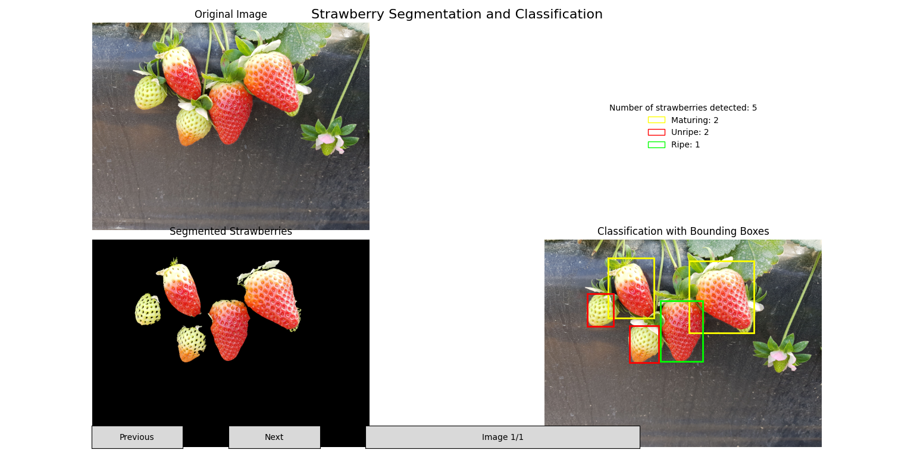

# Strawberry Maturity Classification (Classical Computer Vision)

## 📝 Description

A Classical Computer Vision project using traditional techniques—**no machine learning or neural networks**—to segment and classify strawberry ripeness stages from images.

---

## 📂 Structure

- **strawberry_maturity_cv.py**  
  Main training/evaluation script.

- **dataset/**  
  Folder with sample strawberry images for testing and evaluation.

- **README.md**
  This documentation file.

- **results/**  
  Folder with result images.
    
---

## 🧪 Pipeline Overview

### 🔍 Pre-processing
- Histogram equalization and noise filtering for consistent lighting
- Color-space conversion (RGB → HSV / LAB) to enhance contrast

### ✂️ Segmentation
- Multi-level Otsu thresholding and morphological operations (opening/closing)
- Watershed and contour analysis to separate adjacent berries

### 📐 Feature Extraction & Rule-based Classification
- Extraction of area, mean color, bounding boxes, and shape metrics
- Rule-based labeling using `if-then` logic:
  - **Unripe**
  - **Maturing**
  - **Ripe**

---

## 📷 Example Results



---

## 🚀 How to Run

1. **Clone the repository:**  
   ```bash
   git clone https://github.com/vinisasaki/strawberry-maturity-cv.git
   cd strawberry-maturity-cv
2. **(Optional) Set up a virtual environment:**  
    ```bash
    python3 -m venv venv
    source venv/bin/activate    # Linux/macOS
    venv/Scripts/activate       # Windows
3. **Install dependencies:**
    ```bash
    pip install -r requirements.txt
4. **Execute the script:**
    ```bash
    python strawberry_maturity_cv.py
---
## 📊 Dataset
Images were obtained from StrawDI:

StrawDI. “The Strawberry Digital Images Data Set”. 2018. Available at: https://strawdi.github.io/ (accessed 06/24/2025).
